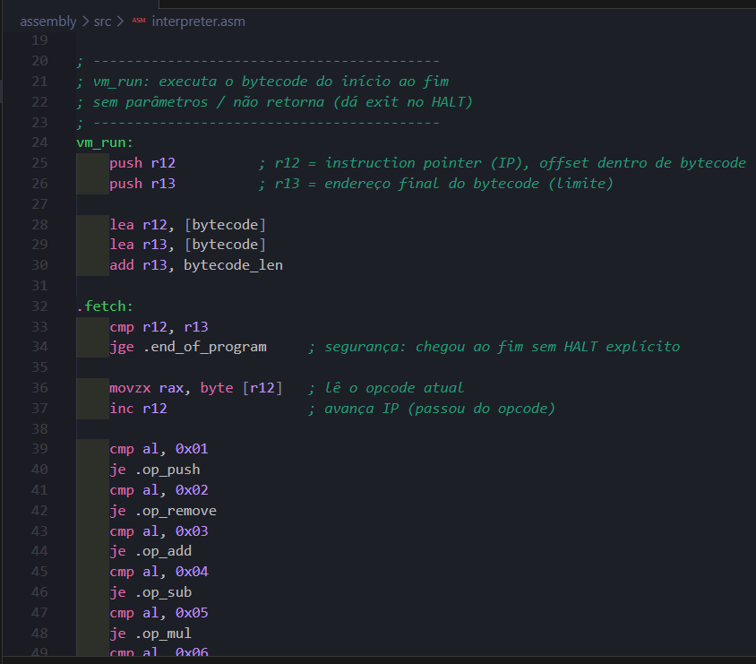
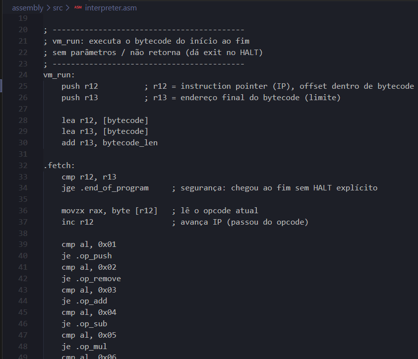

# Mini-VM de Pilha em Assembly (NASM x86-64)

Interpretador de uma mini-VM baseada em pilha, com bytecode próprio, escrito em Assembly x86-64 puro (NASM), sem libc — toda I/O é feita via `syscall` direta ao kernel Linux.

É, na prática, uma calculadora de pilha: você empilha números e executa operações que consomem os itens do topo, produzindo um novo resultado.

---

# Arquitetura

A VM é composta por três partes:

- **Pilha (`vm_stack`)**: array fixo de 4096 células de 64 bits, com um contador (`stack_top`) indicando quantos elementos estão ocupados. Não é a pilha nativa do processador (`RSP`) — é uma região de memória própria, controlada manualmente.

- **Bytecode (`bytecode`)**: programa da VM, escrito como uma sequência de bytes (`db`) em `.data`. É dado estático — só ganha efeito quando o interpretador o executa.

- **Interpretador (`vm_run`)**: loop *fetch-decode-execute* que lê o bytecode byte a byte, identifica o opcode e chama a operação correspondente sobre a pilha.

---

# Opcodes

| Comando | Número | Assembly | Operando | Operação |
|---------|:------:|:--------:|-----------|----------|
| `PUSH` | 1 | `0x01` | 1 byte (com sinal) | Empilha um novo número no topo |
| `REMOVE` | 2 | `0x02` | nenhum | Remove o número da **base** (início) da pilha |
| `ADD` | 3 | `0x03` | nenhum | Remove os dois números do topo e empilha a soma |
| `SUB` | 4 | `0x04` | nenhum | Remove os dois números do topo e empilha a subtração (penúltimo − último) |
| `MUL` | 5 | `0x05` | nenhum | Remove os dois números do topo e empilha a multiplicação |
| `DIV` | 6 | `0x06` | nenhum | Remove os dois números do topo e empilha a divisão (penúltimo ÷ último) |
| `HALT` | 255 | `0xFF` | nenhum | Encerra a execução da VM |

## Regras de execução

1. **Elemento único é protegido**  
   Se a pilha tiver apenas **1 elemento**, nenhuma operação além de `PUSH` é executada (`REMOVE`, `ADD`, `SUB`, `MUL` e `DIV` tornam-se *no-op*).

2. **Estado visível a cada passo**  
   Após **cada** instrução executada — mesmo quando ela não produz efeito — toda a pilha é impressa no formato:

   ```text
   n, n, n
   ```

3. **Faixa de valores do `PUSH`**  
   Como o operando ocupa apenas **1 byte**, o bytecode aceita valores de **-128 a 127**. Internamente, todos os elementos da pilha são armazenados como inteiros com sinal de **64 bits**.

4. **Divisão por zero é protegida**  
   Caso o divisor seja `0`, a operação é desfeita e os dois valores retornam para a pilha, evitando o encerramento do programa por exceção.

---

# Estrutura do projeto

```text
├── Makefile
├── src/
│   ├── main.asm          # ponto de entrada (_start), chama vm_run
│   ├── bytecode.asm      # programa da VM (dados estáticos)
│   ├── interpreter.asm   # loop fetch-decode-execute
│   ├── stack.asm         # vm_push / vm_pop e memória da pilha
│   ├── ops.asm           # vm_remove_first / vm_add / vm_sub / vm_mul / vm_div
│   └── print.asm         # vm_print_stack + conversão int→string
└── build/                # gerado automaticamente (.o e binário)
```

O **Makefile** compila automaticamente qualquer arquivo `.asm` adicionado em `src/`, sem necessidade de alterações manuais.

---

# Como rodar

## Com Docker

```bash
docker compose build
docker compose run --rm asm-vm
```

## Diretamente (Linux ou container com NASM instalado)

```bash
make run
```

Compila (caso necessário) e executa a VM.

Para remover os artefatos gerados:

```bash
make clean
```

---

# Debug com GDB

O projeto é compilado com símbolos de depuração (`-g -F dwarf`), permitindo ao GDB reconhecer labels e arquivos-fonte.

Execute:

```bash
make debug
```

## Breakpoints

```gdb
break _start
break vm_run
break vm_push
```

## Controle de execução

```gdb
run
stepi
nexti
continue
```

Também é possível utilizar as formas abreviadas:

```gdb
si
ni
c
```

## Inspeção de registradores

```gdb
info registers
print $rax
print stack_top
```

## Inspeção de memória

```gdb
x/10gx &vm_stack
x/10gd &vm_stack
x/20xb &bytecode
x/5i $rip
```

### Atenção

Não confunda os dois *instruction pointers*:

- **`$rip`** → registrador real da CPU.
- **`r12`** → usado pela VM para apontar para a posição atual dentro do bytecode.

---

# Trace de syscalls

Como toda a entrada e saída utiliza apenas `syscall`, o `strace` permite visualizar exatamente quais chamadas ao kernel estão sendo feitas.

Execute:

```bash
make trace
```

Exemplo de saída:

```text
write(1, "10, -25, 42\n", 12) = 12
write(1, "10, 17\n", 7) = 7
...
exit(0) = ?
+++ exited with 0 +++
```

Use:

- **GDB** para investigar erros de lógica (pilha incorreta, operações erradas, fluxo de execução).
- **strace** para investigar problemas de I/O ou encerramentos inesperados.

---

# Destaque de sintaxe

Para obter destaque de sintaxe em Assembly x86-64 no VSCode, recomenda-se a extensão:

> **13xforever.language-x86-64-assembly**

<p align="center">
  
  
</p>

<p align="center">
  <em>Esquerda: com a extensão • Direita: sem a extensão</em>
</p>
